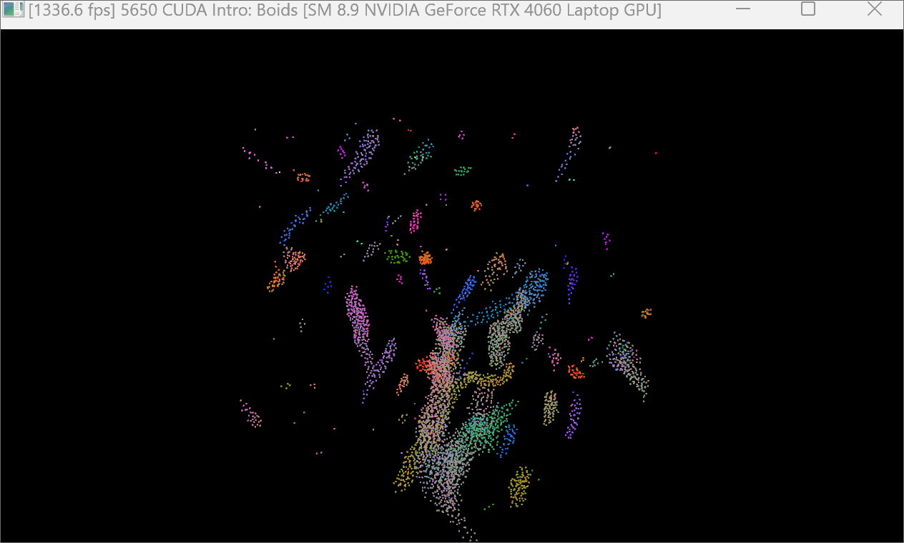
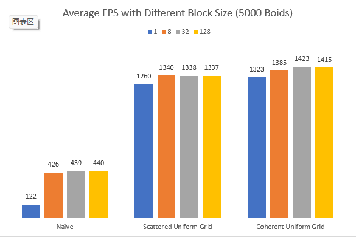
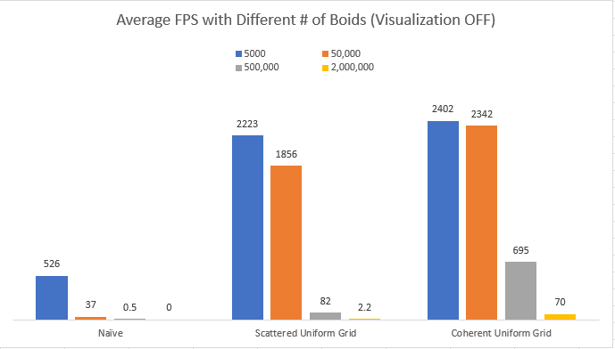
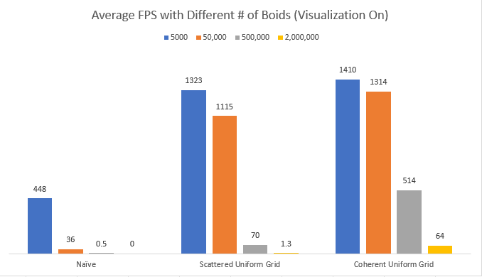

**University of Pennsylvania, CIS 565: GPU Programming and Architecture,
Project 1 - Flocking**

* Shineng Tang
  * [LinkedIn](https://www.linkedin.com/in/shineng-t-224192195/)
* Tested on: Windows 11, i9-10900k @3.7GHz 32GB, RTX 3090 24GB

# Screenshots

*5000 boids

*50,000 boids

*500,000boids

# Performance Charts

# Introduction 
In this CUDA project, I implemented three methods to search through all boids in the space and update their positions and velocity to form a flocking behavior.
* Naive method: Search through all the boids in the space and perform calculations on them.
* Scattered uniform grid: By using uniform grid, I only search through boids within certain distances to get rid of a lot of unnecessary calculations.
* Coherent unfiform grid: Based on the uniform grid method, I reshuffled the positions and velocity buffers to make them contiguous in memory, reducing access to the global memory.

### For each implementation, how does changing the number of boids affect performance? Why do you think this is?

By increasing the number of boids, I experienced a noticable frame rate drop. This is because the number of boids ,at a certain point, exceeds the number of threads on the GPU. Thus the threads need more time to handle all the calculations.

### For each implementation, how does changing the block count and block size affect performance? Why do you think this is?

The performance difference is noticable when I compared block size 1 and other numbers. However, after reaching a certain number, the block size stops affecting performance. This is because there are only limited number of threads on the gpu that are working at the same time. When the block size reaches a certain number, there aren't enough threads.

### For the coherent uniform grid: did you experience any performance improvements with the more coherent uniform grid? Was this the outcome you expected? Why or why not?

I did experience performance improvements as you can see from the charts above. It was the outcome I expected because by reshuffling the velocity and position buffer in a kernel function. It reduced the number of times to access the global memory, thus boosting up the performance.

### Did changing cell width and checking 27 vs 8 neighboring cells affect performance? Why or why not? Be careful: it is insufficient (and possibly incorrect) to say that 27-cell is slower simply because there are more cells to check!

Yes, It did. Checking 27 neighboring cells gives more fps especially when dealing with larger number of boids. I was actually not expecting this result. I think the main reason is that checking 27 cells with half the cell width reduces the volume of the search space. (3 * 3 * 3 < (2 * 2) ^ 3)   

