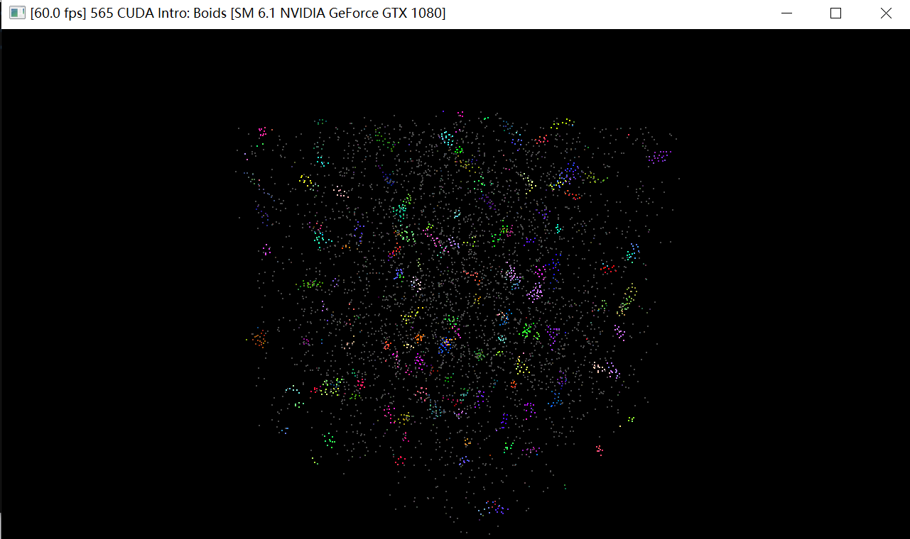
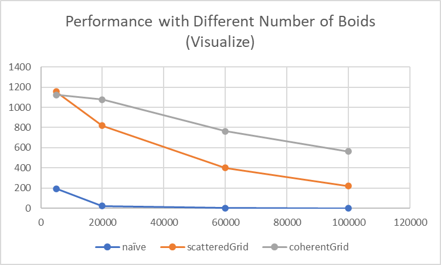
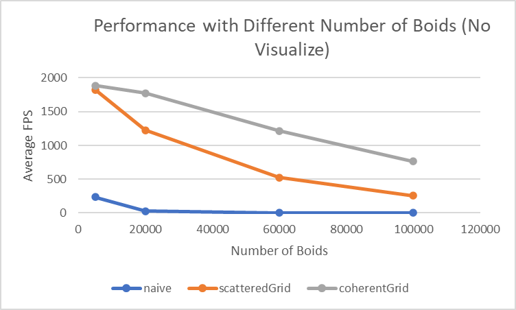
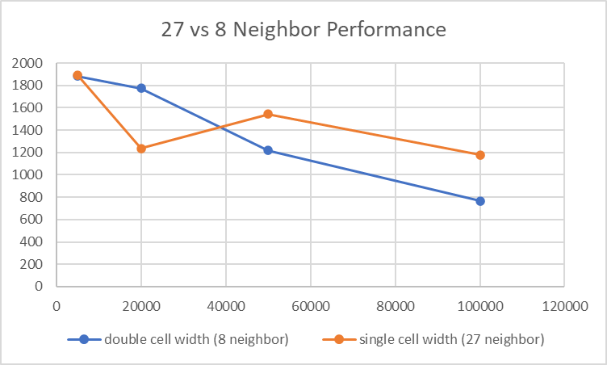

**University of Pennsylvania, CIS 565: GPU Programming and Architecture,
Project 1 - Flocking**

* Yiyang Chen
  * [LinkedIn](https://www.linkedin.com/in/yiyang-chen-6a7641210/), [personal website](https://cyy0915.github.io/)
* Tested on: Windows 10, i5-8700k @ 3.7GHz, GTX 1080, personal computer

## Screenshot and Video

## Performance Analysis

(coherent grid, 600000 boids)

**For each implementation, how does changing the number of boids affect
performance? Why do you think this is?**

Answer: Increasing the number of boids will reduce performance. I think it's obvious because more boids means more computation involving searching for neighbors, updating velocities, etc.

**For each implementation, how does changing the block count and block size
affect performance? Why do you think this is?**

Answer: When the block size is very small, for example 16 or 32, the performance is bad, and when the block size is bigger than 128, it's almost the same, see the above figure. I think it's because that, when the block size is very small, the block count is large, so it's less parallel, which affects performance.

**For the coherent uniform grid: did you experience any performance improvements
with the more coherent uniform grid? Was this the outcome you expected?
Why or why not?**

Answer: the more coherent uniform grid is faster. It's the outcome I expected, because it's memory friendly when getting and setting position and velocity array. 

**Did changing cell width and checking 27 vs 8 neighboring cells affect performance?
Why or why not? Be careful: it is insufficient (and possibly incorrect) to say
that 27-cell is slower simply because there are more cells to check!**

(coherent grid, 128 block size)

It affects performance. When the boids number is small, 8 neighbor performs better than 27 neighbor. But when the boids number is large, 27 neighbor performs better than 8 neighbor. I think the reason is that: When the boids are sparse in the space, the number of all boids they check in neighbor is about the same but iterating 27 neighbor cost more than 8. When the boids are dense, because the space range of 8 neighbor (double cell width) is larger than 27 neighbor, it will check more boids, affecting the preformance.