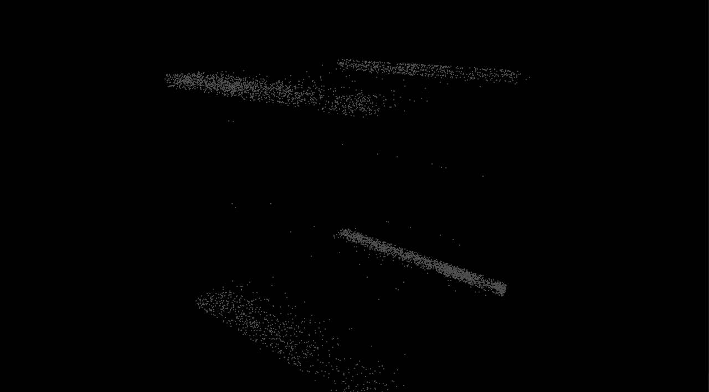

**University of Pennsylvania, CIS 565: GPU Programming and Architecture,
Project 1 - Flocking**

* Nick Moon
  * [LinkedIn](https://www.linkedin.com/in/nick-moon1/), [personal website](https://nicholasmoon.github.io/)
* Tested on: Windows 10, AMD Ryzen 9 5900HS @ 3.0GHz 32GB, NVIDIA RTX 3060 Laptop 6GB (Personal Laptop)

### Results

5000000 boids, 1.75 dt timestep, 400.0 scene scale, 1.5 max speed

5000 boids, 0.2 dt timestep

5000 boids, 1.0 dt timestep

500 boids, 1.0 dt timestep

500000 boids, 1.0 dt timestep

50000 boids, 1.0 dt timestep, 0.25 maxspeed, neighborhood search distances multiplied by 0.5

50000 boids, 1.0 dt timestep, 0.5 maxspeed, neighborhood search distances multiplied by 1.35x

**Performance Analysis**

For each implementation, how does changing the number of boids affect performance? Why do you think this is?

For each implementation, how does changing the block count and block size affect performance? Why do you think this is?

For the coherent uniform grid: did you experience any performance improvements with the more coherent uniform grid? Was this the outcome you expected? Why or why not?

Did changing cell width and checking 27 vs 8 neighboring cells affect performance? Why or why not? Be careful: it is insufficient (and possibly incorrect) to say that 27-cell is slower simply because there are more cells to check!

### Bloopers

