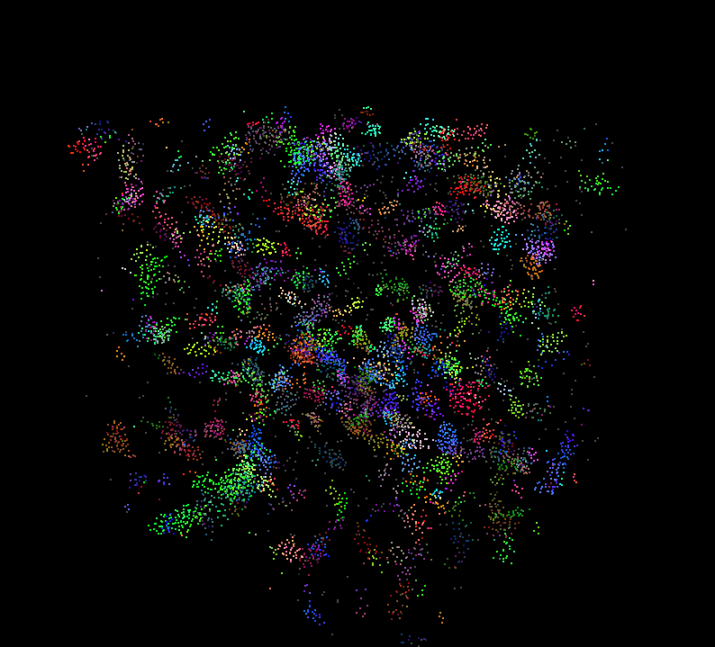

**University of Pennsylvania, CIS 5650: GPU Programming and Architecture,
Project 1 - Flocking**

* Catherine Cheng
  * [LinkedIn](https://www.linkedin.com/in/catherine-wanning-cheng/), [personal website](https://www.catherine-wanning-cheng.com/projects-1)
* Tested on: Windows 11, AMD Ryzen 7 5800H @ 3.20GHz 16GB, NVIDIA GeForce RTX 3070

## Performance Analysis
### Q1: For each implementation, how does changing the number of boids affect performance? Why do you think this is?

Below are the charts indicating the relationship between Boid Number and average FPS for different implementation:

FPS change with boid count with visualization            |  FPS change with boid count without visualization 
:-------------------------:|:-------------------------:
  |  

According to the charts, we can see that average FPS decreases as boid number increases. Also, as naive method performs significant slower than uniform grid methods, uniform methods optimizes the simulation by greatly reducing the numbers of comparison between boids.

Specifically, in naive method, checks are performed on every boid by comparing it with every other boid. Thus, the complexitiy of this method is $O(N^2)$. In this way, increasing boid number would greatly decreases simulation frame rate as checks between every other boid become increasingly expensive.

Uniform Grid method, on the other hand, greatly reduces the number of neighbor boid checks by assigning grids based on distance and culling out the boids that are not in closer grids. In this way, checks performed during each iteration become far less expensive and thus optimizes the simulation.

Coherent Uniform Grid method is a further optimization upon Uniform Grid method. In Uniform Grid method, we need to track through pointers to retrieve corresponding data (position and velocity) of each grid. Yet in Coherent Uniform method, we pre-process the data indices and rearrange the data pointer in the form of contiguous memory to reduce the expense of reads and thus furthur optimizes Uniform Grid Method.

### Q2: For each implementation, how does changing the block count and block size affect performance? Why do you think this is?

When testing block size, I found fps kept increasing from 4 to 128 and started to decrease after then. When block size is small, the kernel is not fully untilizing GPU resources, and increasing block size would lead to higher occupancy and better resource utilization, and thus better performance. On the other hand, when block size gets larger, fewer blocks can fit on a single multiprocessor due to limited shared resources and thus causes the simulation to slow down after the peak.

### Q3: For the coherent uniform grid: did you experience any performance improvements with the more coherent uniform grid? Was this the outcome you expected? Why or why not?

Yes. I did experience performance improvements with the Coherent Uniform Grid method. I initially expected it to have better performance (in this case higher FPS) comparing to the Scattered Uniform Grid method, and the results are as expected. This is because Coherent Uniform Grid method rearranges the data and thus makes accessing these data less expensive. Although it is not as aparent when simulating a small number of boids, when boid number become larger, such optimization can be more aparent according to previous charts.

### Q4: Did changing cell width and checking 27 vs 8 neighboring cells affect performance? Why or why not? Be careful: it is insufficient (and possibly incorrect) to say that 27-cell is slower simply because there are more cells to check!

When tested checking 8 cells and 27 cells at smaller boid number, checking 8 cells is slightly faster than checking 27 cells but the difference was not really obvious. However, when simulating very large number of boids, 27 cells could perform faster than 8 cells. Such difference could result from my comparing method, which, when checking 27 cells, I changed the cell width of the uniform grid to be the neighborhood distance instead of twice of the neighborhood distance. Thus, when boid number becomes larger, the smaller size of the cells eventually leads to fewer checks with other boids comparing to checking 8 cells with the twice of the neighborhood distance.