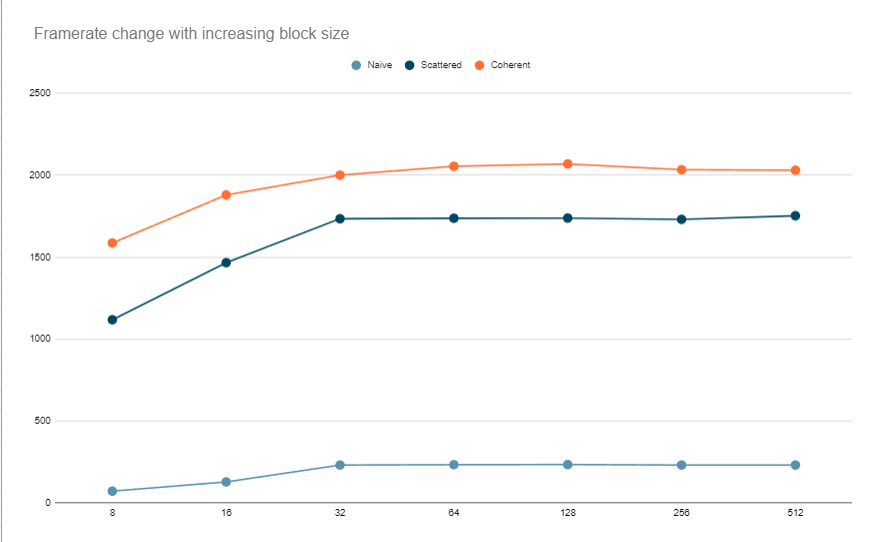

**University of Pennsylvania, CIS 5650: GPU Programming and Architecture,
Project 1 - Flocking**

* ANNIE QIU
  * [LinkedIn](https://github.com/AnnieQiuuu/Project0-Getting-Started/blob/main/www.linkedin.com/in/annie-qiu-30531921a)
* Tested on: Windows 11, i9-12900H @2500 Mhz, 16GB, RTX 3070 Ti 8GB (Personal)

## Features

### Naive Boids Simulation
- Loop over all the boids to get the neighbors.

### Scattered Boids Simulation
- Implemented uniform grid to reduce the number of neighbor checks.

### Coherent Boids Simulation
- Optimized the simulation further by making the grid memory accesses coherent by sorting the vel and pos.
- Reduce the number of neighbors to check in extra creadits part.

## Screenshots

### Screenshot 1
- Optimized coherent; number of boids = 5000; block size = 128

### Screenshot 2
- Optimized coherent; number of boids = 500000(really large amount); block size = 128

## Performance Analysis

### Framerate change with increasing # of boids

- Descriptions: The dashed lines represent the performance without visualization, and the solid lines represent performance with visualization. I chose 1000, 5000, 10000, 20000, and 50000 boids for testing. The y-axis is the frames per second (FPS), and the x-axis is the number of boids.
1. How does changing the number of boids affect performance for each implementation? Why do you think this is?
  - Naive simulation: This is the slowest among the three implementations, and the FPS drops drastically as the number of boids increases. This is because the Naive Simulation requires looping through every single boid, resulting in 𝑂 ( 𝑁 2 ) O(N 2 ) complexity. As 𝑁 N increases, the speed becomes significantly slower.
  - Scattered simulation： By using a uniform grid, we can reduce the number of boids each boid has to check. In this case, I limited the search to the boids in 27 or 8 nearby cells, which dramatically decreases complexity.
  - Coherent simulation：This is an optimized version of the scattered implementation. By sorting the pos and vel arrays, we reduced memory access times, further improving efficiency. In the extra credit part, I made further optimizations to the coherent implementation. Based on the boid’s position in the cell, I dynamically chose which neighboring cells to check. This reduces the need to check all 27 cells while still maintaining accurate neighbor checks, resulting in even better performance.

### Framerate change with increasing block size

- Descriptions:
2. How does changing the block count and block size affect performance for each implementation?
  - Naive Simulation: Performance improves slightly with increasing block size, but the impact is minimal. The main bottleneck remains the large number of neighbor checks, which is not significantly affected by block size changes.
  - Scattered Simulation: Performance improves more noticeably with larger block sizes. The uniform grid approach allows each thread to process fewer boids, so increasing the block size allows more efficient parallel processing, leading to better performance.
  - Coherent Simulation: The coherent grid implementation also shows performance improvements with larger block sizes, but the gains are less dramatic compared to the scattered implementation. This is because memory access is already optimized in the coherent implementation, and block size changes primarily affect parallelism, not memory access.

3. Did you experience any performance improvements with the coherent uniform grid? Was this the outcome you expected? Why or why not?

### 27 vs. 8 Neighbor Cells
| Cells to check | Scattered     | Coherent |
|---------------:|---------------|----------|
|     8          |   2080        |   2140   |
|     27         |     1520      |   2080   |
4. Did changing cell width and checking 27 vs. 8 neighboring cells affect performance? Why or why not?

## Extra Credits