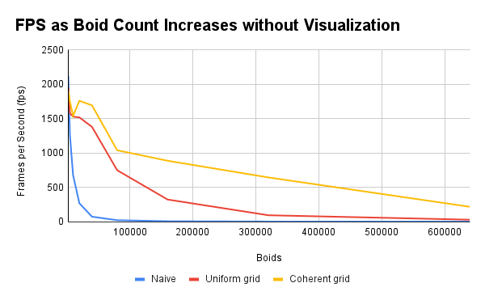

**University of Pennsylvania, CIS 5650: GPU Programming and Architecture,
Project 1 - Flocking**

* CARLOS LOPEZ GARCES
  * [LinkedIn](https://www.linkedin.com/in/clopezgarces/)
  * [Personal website](https://carlos-lopez-garces.github.io/)
* Tested on: Windows 11, 13th Gen Intel(R) Core(TM) i9-13900HX @ 2.20 GHz, RAM 32GB, NVIDIA GeForce RTX 4060, personal laptop.

# Boid flocking simulation

Simulation of flocking behavior of boids (bird-oid particles), accelerated using CUDA.

At each time step of the simulation, the position and velocity of each boid is updated according to 3 rules: (1) *cohesion*, according to which a boid will head towards the center of mass of nearby boids; (2) *separation*, according to which a boid will keep some distance from nearby boids; and (3) *alignment*, according to which a boid will head in the same direction and with the same velocity as nearby boids. 

## 3 implementations

The "nearby boids" are determined based on a fixed radius, which may be different for each rule.

The search for nearby boids has 3 implementations, a naive one, one that partitions the space using a uniform grid, and one that optimizes memory access using that same uniform grid. Details follow.

### Naive

To search for nearby boids, each boid compares distance against every other boid against each of the 3 rules' thresholds.

GIF shows the default 5000 boids, using default block size 128.

### Uniform grid

To avoid comparing distance with every other boid, space is partitioned into a uniform grid and each boid only compares distance against boids in up to 2 cells along each dimension (x, y, z): since each cell is twice the maximum neighborhood radius, each boid only needs to compare distance against boids in its own cell and up to 1 extra adjacent cell in each dimension (the neighborhood can only every overlap uo to 2 adjacent cells in each dimension).

GIF shows the default 5000 boids, using default block size 128.

### Coherent uniform grid

To avoid using an intermediary index buffer to find position and velocity of boids, these arrays are rearranged so that they can be found at the same index as the boid index / cell index array. This allows for coalesced memory accesses.

GIF shows the default 5000 boids, using default block size 128.

## Performance graphs

The uniform grid optimization outperforms the naive one because each boid is compared against fewer other boids. The coherent grid on top of the uniform grid optimization also boosts framerate because coalesced memory access allows for efficient use of the cache.

As a result of turning visualization off, FPS naturally goes up.

Block sizes of 32, 64, 128, 256, 512, and 1024 are compared for 5000 boids.

## Questions

***For each implementation, how does changing the number of boids affect performance? Why do you think this is?***

In the naive implementation, fps sharply decreases because the number of neighborhood checks ***per boid*** increases linearly with the number of total boids.

In the two uniform grid implementations, fps decreases less sharply than in the naive implementation; this is because, while the number of boids to check in adjacent cells varies, on average there are fewer boids there than the total.

With the coherent grid optimization, fps decreases even less sharply. The memory access pattern improves and, as a result, the cache is used more efficiently, decreasing time per frame.

***For each implementation, how does changing the block count and block size affect performance? Why do you think this is?***

I compared block sizes of 32, 64, 128, 256, 512, and 1024 for 5000 boids. In the naive implementation, increasing block size led to decreased framerate. In the other two implementations, average framerate increases as block size increases from 32 to 64, and then appears to decrease as it increases to 128, 256, and 512, to finally increase when block size is 1024. A fluctuation is observed, but it's not very drastic.

There may be many reasons behind these observations. One explanation for the increased fps from 32 to 64, is that fewer blocks (with more threads) are used and these threads are able to leverage cache loads from other threads in the same block. A reason for seing decreased fps afterwards is increased register pressure that prevents parallel scheduling.

***For the coherent uniform grid: did you experience any performance improvements with the more coherent uniform grid? Was this the outcome you expected? Why or why not?***

Yes. Framerate decreases less sharply with this optimization. This is likely the result of using the cache more efficiently, since we are now accessing contiguous array elements more frequently (better memory access pattern that leads to reduced memory latency), as opposed to scattered elements.

***Did changing cell width and checking 27 vs 8 neighboring cells affect performance? Why or why not? Be careful: it is insufficient (and possibly incorrect) to say that 27-cell is slower simply because there are more cells to check!***

Decreasing cell width appears to improve performance because the set of nearby adjacent cells to check surrounds nearby boids more tightly; this results in fewer boids being checked (fewer computations per boid and fewer memory accesses). When cells are larger, there may be boids in the outermost checked cell that may not be within the neighborhood radius (and still they are checked).