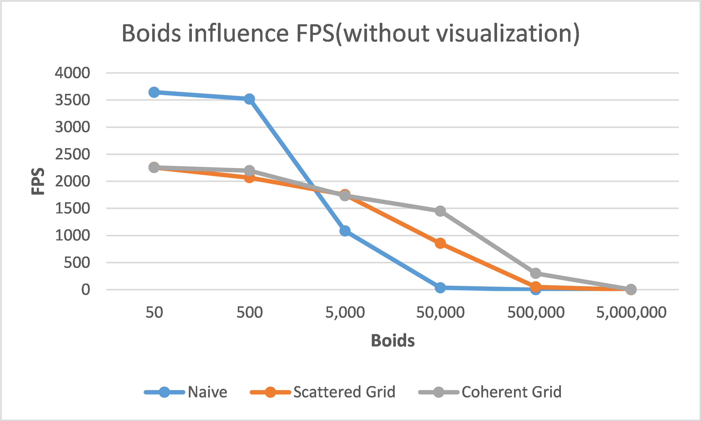
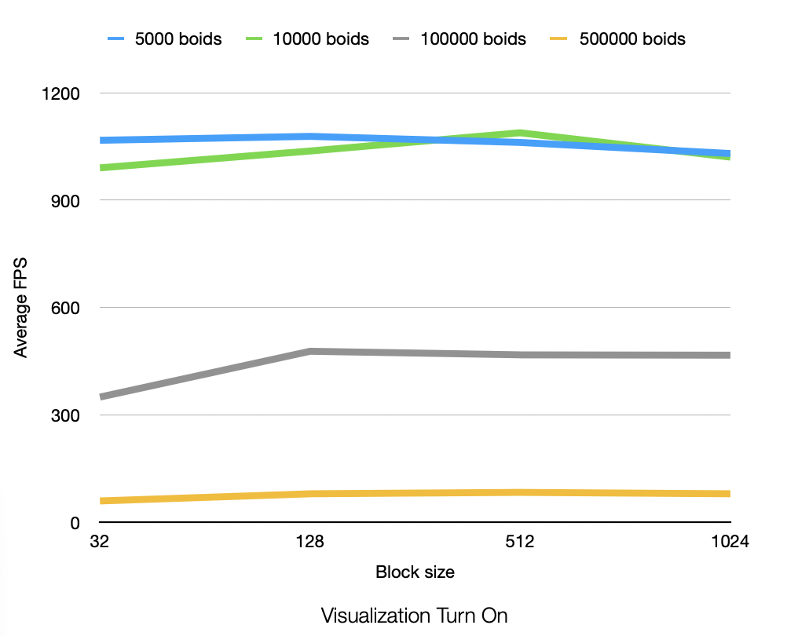

**University of Pennsylvania, CIS 5650: GPU Programming and Architecture,
Project 1 - Flocking**

* Zhiyi Zhou
* Tested on: Windows 11, i9-13900H @ 2.6GHz 64GB, RTX4060 Laptop

### Screenshots

* `N_FOR_VIS = 5,000; scene_scale=100.0f`

* `N_FOR_VIS = 500,000; scene_scale=100.0f`

### Analysis

**Figure 1**: FPS changes with increasing boids' number(no visualization)

**Figure 2**: FPS changes with increasing boids' number(with visualization)

**Figure 3**: FPS changes with increasing block size(use 50,000 boids)

### Questions

#### Questions

* For each implementation, how does changing the number of boids affect performance? Why do you think this is?
  * For all three implementations, increasing the number of boids overall reduces the performance and the performance reduction of the Naive method is particularly significant, this is because the Naive method will search all boids.
* For each implementation, how does changing the block count and block size affect performance? Why do you think this is?
  * For all three implementations, increasing block size increases the performance before the block size reach 32, this is probably because the actual working unit in SM are warps and 1 warp contains 32 threads, if block size is not a multiple of 32, some some warps will have idle threads.

* For the coherent uniform grid: did you experience any performance improvements with the more coherent uniform grid? Was this the outcome you expected? Why or why not?
  * The performance is not improved until the number of boids increases to a certain amount. This is probably because the cost of sorting boids of small number is larger than the improvement.
* Did changing cell width and checking 27 vs 8 neighboring cells affect performance? Why or why not? Be careful: it is insufficient (and possibly incorrect) to say that 27-cell is slower simply because there are more cells to check!
    * If the number of boids is not very big, the 27-cell search is much slower than the 8-cell search but when the boids increase to a certain amount(in my case 500,000 is large enough) the situation is reversed. I think the reason is that when the number of boids is small, the main cost is the sorting of the cells but as boids increasing, each cell will cover much more boids, and 27-cell search can cover less space, in other words, less boids to search.