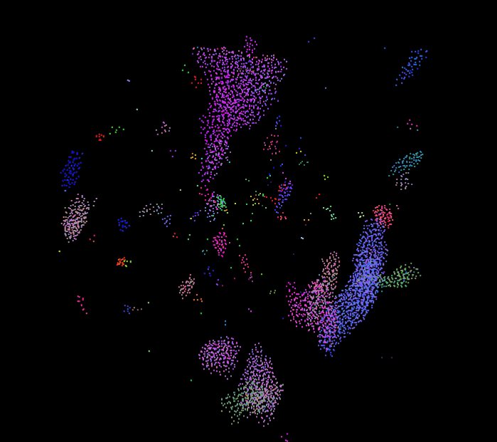
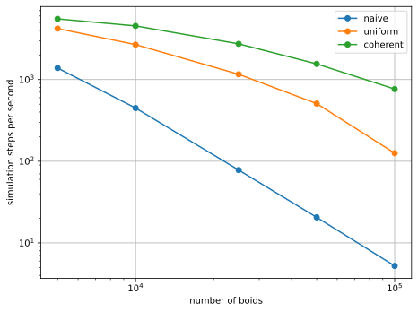

Project 1 Flocking
====================

**University of Pennsylvania, CIS 5650: GPU Programming and Architecture**

* Dominik Kau
  * https://www.linkedin.com/in/dominikkau/
* Tested on: Windows 10, i7-12700 @ 2.10 GHz, 32 GB, T1000 4096 MB (CETS machine)

## Boids flocking simulation

In the Boids flocking simulation, particles representing birds or fish (boids) move around the simulation space according to three rules:

- cohesion: boids move towards the perceived center of mass of their neighbors
- separation: boids avoid getting to close to their neighbors
- alignment: boids generally try to move with the same direction and speed as their neighbors

These three rules specify a boid's velocity change in a timestep. At every timestep, a boid thus has to look at each of its neighboring boids and compute the velocity change contribution from each of the three rules. Thus, a bare-bones boids implementation has each boid check every other boid in the simulation.
(Description from https://github.com/CIS5650-Fall-2024/Project1-CUDA-Flocking/blob/main/INSTRUCTION.md)

The code includes three different implementations of the boid algorithm. 
- The first simulation ("naive") loops over every boid and then checks every other boid for the application of the three rules.
- The second simulation ("uniform") still loops over every boid but will only check boids in the "direct vicinity" for the application of the three rules.
For this, the simulation domain is split into a grid of uniform cells that are used to determine the neighboring boids in "direct vicinity".
- The third simulation ("coherent") works very similar to the second one, but the underlying arrays are arranged more optimally - coherent - in memory to speed up checking the three rules.

## Visual Results

Simulation visualization result for 5,000 boids:

Simulation visualization result for 50,000 boids:

## Performance Analysis Results

The performance was measured by averaging the number of simulation steps per second over a time of 10 s.
Thus, only the actual simulation side of the program is benchmarked.

### Performance Over Boid Count (No Visualization)

The performance of the basic implementation ("naive") is by far the worst. 
This stems from the fact that the algorithm has quadratic complexity $\mathcal O(n^2)$ in the number of boids.
Using the uniform grid ("uniform") to only check boids in neighbouring cells improves the performance significantly - especially for large numbers of boids.
Optimizing the memory layout of the underlying arrays ("coherent") yields another significant improvement, showing the impact that global memory access has on overall performance.
It was surprising for me to see how much of a difference this causes.
For this analysis the visualization of the boids was turned off. 

### Performance Over Boid Count (With Visualization)

The same tendencies as before can be observed when the visualization is turned on.
The overall performance is barely impacted, because the performance measurements do not include the visualization computations.

### Performance Over Block Size (No Visualization)

For all three implementations, changing the block size on the call of the kernel does not have a significant effect on performance.
All kernels use global memory and therefore the performance will not suffer significantly from a reduction of threads in a block.

### Performance over Cell Size (No Visualization)

In this comparison of the second implementation on the uniform grid, the cell width was reduced in relation to the maximum distance of the rules.
This leads to an increase in the (maximum) number of cells that have to be checked - 27 cells instead of 8.
The new implementation leads to an performance increase in the simulations with an intermediate number of boids $\mathcal O(10,000)$.
Below that, the low number of boids in each cell is not worth the finer grid, so the performance does not increase.
For higher boid counts, I suspect that the increased memory requirements slow the simulation down - however I was not able to confirm this without the Nsight performance tools.

