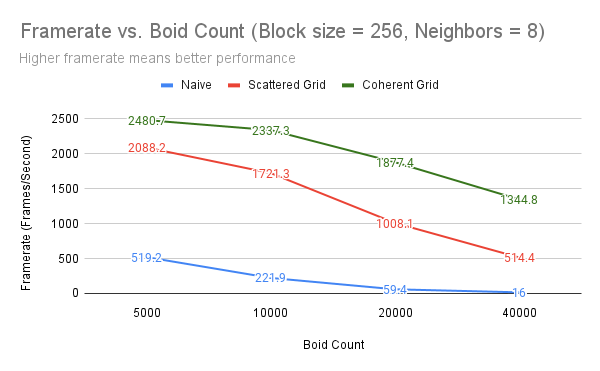
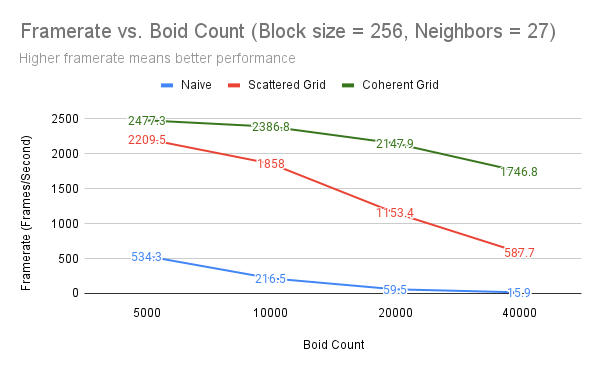

**University of Pennsylvania, CIS 5650: GPU Programming and Architecture,
Project 1 - Flocking**

* Kyle Bauer
  * [LinkedIn](https://www.linkedin.com/in/kyle-bauer-75bb25171/), [twitter](https://x.com/KyleBauer414346)
* Tested on: Windows 10, i-7 12700 @ 2.1GHz 32GB, NVIDIA T1000 4GB (CETS Virtual Lab)

8 Neighbors                |  27 Neighbors
:-------------------------:|:-------------------------:
      |  
      | 

### Q1 For each implementation, how does changing the number of boids affect performance? Why do you think this is?

While the performance noticeably decreased each time the boid count was doubled, the way each implementation changed varied greatly. The naive implementation seemed to drop a third of its framerate each double, whereas the scattered uniform grid usually did not even lose half of its framerate. The coherent uniform grid performed the best out of all three falling off even more gradually than the scattered variant. The naive implementation falling off the fastest makes the most sense as adding a new boid requires one additional check for every other boid in addition to the new boid having to check all the existing boids, quickly creating more work for each boid as the number of boids increases. This is different compared to the scattered and coherent grids as those implementations have culled most of the boids around them. However, those two implementations still see noticeable performance drop-offs because they are still affected by densly packed boids - Every close boids still need to accounted for when figuring out how each boid reacts.

### Q2 For each implementation, how does changing the block count and block size affect performance? Why do you think this is?

Changing the block size and block count did not noticeably affect performance. Due to the implementation, block size and block count are linked in an attempt to fill the grid as best as possible. Therefore, changing the block size will modify the block count and they should approximately balance eachother out.

### Q3 For the coherent uniform grid: did you experience any performance improvements with the more coherent uniform grid? Was this the outcome you expected? Why or why not?

The coherent grid performed noticeably better than the scattered grid which I found to be unexpected. I wasn't sure if the extra work required to make the grid coherent would be worth the performance gain from having better locality in memory, but clearly by the performance analysis it outperformed the scattered grid.

### Q4 Did changing cell width and checking 27 vs 8 neighboring cells affect performance? Why or why not? Be careful: it is insufficient (and possibly incorrect) to say that 27-cell is slower simply because there are more cells to check!

There was a significant increase in performance when checking 27 neighboring cells versus checking just 8 cells. This was most noticable for the dense (40k boids) coherent grid. I believe this is happening because the more densely packed grids benefit from a smaller cell width - It allows them to cull more boids early on. At those denser scales, the culling of boids out-weighed the performance hit of organizing a finer coherent grid.
