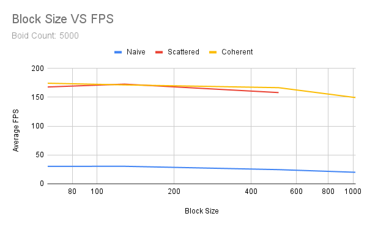

**University of Pennsylvania, CIS 5650: GPU Programming and Architecture,
Project 1 - Flocking**

* Daniel Gerhardt
  * https://www.linkedin.com/in/daniel-gerhardt-bb012722b/
* Tested on: Windows 23H2, AMD Ryzen 9 7940HS @ 4GHz 32GB, RTX 4070 8 GB (Personal Laptop)

### Project 1 README

## Description:
This project implements a boid simulation. A boid is a "bird-oid", a particle that moves according to 3 rules that are meant to emulate how birds move. The rules are:
1. cohesion - boids will move towards the center of their surrounding boids
2. separation - boids will keep a distance from the boids closest to them
3. alignment - boids will attempt to follow the direction and speed of their surrounding boids

The simulation was implemented in 3 different ways. The first was a naive algorithm that checked each boid against all the others. The second limited the scanning by checking only boids in neighboring grid cells. The third reduced overhead further by doing a coherent search in memory within the neighboring cells.

# Screenshots with 5000 boids:
The following images were taken one minute apart.

# Screenshots with 100,000 boids:
The following images were taken one minute apart.

## Performance Analysis:
Performance was measured using FPS with visualization of the boids disabled so that only the simulation's performance was measured. After a brief 10 second stabilization period, the average FPS was recorded over 20 seconds with varying boid count and block sizes. The three implementations are labeled naive, scattered, and coherent respectively.

# Boid count performance measurement(no visualization):

# Boid count performance measurement(with visualization):

# Block size performance measurement:

# Outliers:
Notably the naive method could not run the simulation with 200,000 boids and could barely run the simulation with 100,000. Also the scattered grid threw a CUDA error when the block size was 1024, which is why the data is not present.

# Insights:
Increasing the number of boids causes a decrease in performance. This is likely caused by the increase in kernel processes as the boid count increases, and the larger number of boids that are checked against to complete the simulation requirements. 

Changing block size caused a small decrease in performance. This was unexpected but was likely caused by the memory reads causing other blocks to wait for a block to be swapped out, and the SM handling larger blocks meant less could be run in parrallel.

The coherent uniform grid caused a small performance increase over the scattered grid. This is waht I was expected. The performance difference as boids increased was more apparent between the grid search methods, which makes sense as the optimization is memory based and memory can be more scattered across a larger number of boids. There is also less memory access as one array has been optimized out by the approach.

Changing cell width to check 27 rather than 8 cells increased performance in the coherent grid from 173.5 to 259.5 average FPS, and similarly in the scattered frid from 171.6 to 256.4 average FPS. The increased performance is probably due to a smaller number of boids being in the neighboring cells since they are smaller, so there are usually less boids to iterate through.