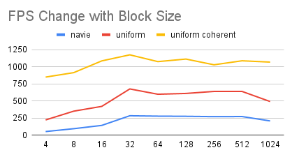

**University of Pennsylvania, CIS 5650: GPU Programming and Architecture,
Project 1 - Flocking**

* Yifan Lu
  * [LinkedIn](https://www.linkedin.com/in/yifan-lu-495559231/), [personal website](http://portfolio.samielouse.icu/)
* Tested on: Windows 11, AMD Ryzen 7 5800H 3.20 GHz, Nvidia GeForce RTX 3060 Laptop GPU (Personal Laptop)

## 1. Flocking Simulation Introduction

This project is a flocking simulation based on the Reynolds Boids algorithm:

- cohesion - boids move towards the perceived center of mass of their neighbors
- separation - boids avoid getting to close to their neighbors
- alignment - boids generally try to move with the same direction and speed as their neighbors

The implement includes two levels of optimization: a uniform grid, and a uniform grid with semi-coherent memory access.

*Block size: 128, Number of Boids: 10000, Neighbor Search 27 Grids, Uniform Grid*

## 2. Performance Analysis

### 2.1 Performance Change with Number of Boids
- **Q1 For each implementation, how does changing the number of boids affect performance? Why do you think this is?**

For Navie method, since we have to compute the distance of each boid against others, the complexity is $O(N^2$). So if we increase the boid size N times from a previous one, the computation will be $N^2$ times. 

For Uniform Grid method, the performance will decrease linearly as the boid number increases. This is because when updating the pos and vel of each particle, we only have to search a fixed size of neighboring grids for neighbor particles. 

As for Coherent Uniform Grid method, the perfomance impact is similar to the Uniform Grid method. However, since the Coherent method has an improved memory access for accessing contiguous memory for particle in the same grid, the performance decrease will be less significant than the Uniform Grid method.

### 2.2 Performance Change with Block count & Block Size

- **Q2 For each implementation, how does changing the block count and block size affect performance? Why do you think this is?**

*Number of Boids: 10000 Neighbor Search 27 Grids*

The fps gerally increases before the block size hit the number 32, which is the warp size. After that, the fps reaches a plateau with slight variances. For large numbers of boids, a larger block size increases the overall performance. However as the block size keeps increasing, the affect of performance improvement becomes less significant. The number of blocks determines the parallel utility when computing so increased block size will boost performance. However as the block size becomes too large, the time to access to registers and memory also increases.

### 2.3 Performance Comparison against Uniform Grid and Coherent Uniform Grid

- **Q3 For the coherent uniform grid: did you experience any performance improvements with the more coherent uniform grid? Was this the outcome you expected? Why or why not?**

The coherent uniform grid method yeilds better performance when the boid number is very large (in my case it is around 100000). I expected a significant better performance in large boid number because the coherent memory for boid attributes can make the memory accessing more efficiently when updating the particle's velocity and position.

### 2.4 Performance Change with Neighboring Cell Count

- **Q4 Did changing cell width and checking 27 vs 8 neighboring cells affect performance? Why or why not?**

*tested with block size 128*

It may not affect performance. The purpose of checking neighoring cells is finding neighbor particles to update velocity. The number of neighbor particles is determined by the initiated random position as well as the grid/cell size and may vary for each simulation. Also with the contiguous memory, we cannot guarantee a better memory access of 8 girds compared to 27 grids. During my tests, the frame rate difference between 8 and 27 neighboring grids decreases as the number of boids increases.

