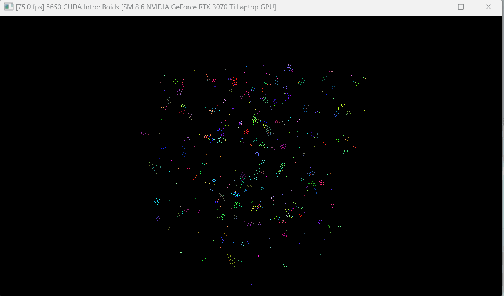
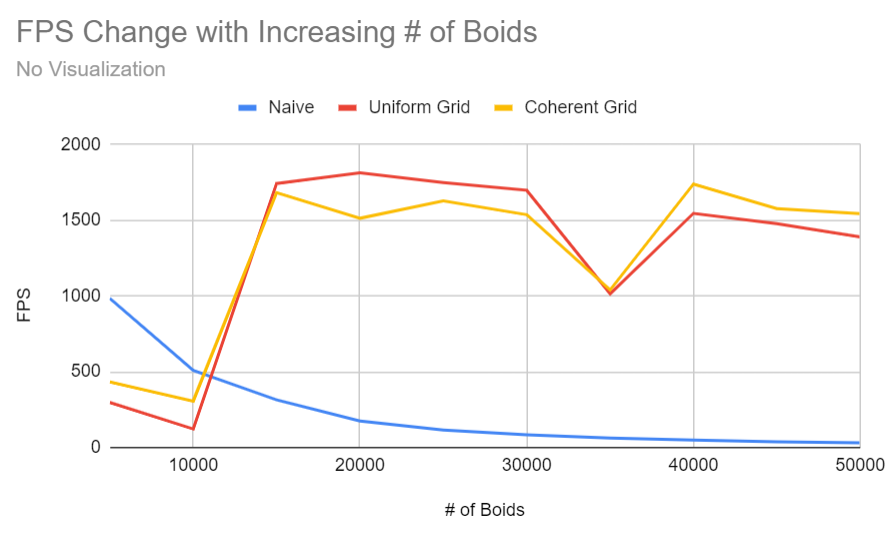

**University of Pennsylvania, CIS 5650: GPU Programming and Architecture,
Project 1 - Flocking**

* Joanna Fisch
  * [LinkedIn](https://www.linkedin.com/in/joanna-fisch-bb2979186/), [Website](https://sites.google.com/view/joannafischsportfolio/home)
* Tested on: Windows 11, i7-12700H @ 2.30GHz 16GB, NVIDIA GeForce RTX 3060 (Laptop)

### Introduction

In this project, I implement a flocking simulation based on the Reynolds Boids algorithm, along with two levels of optimization: a uniform grid, and a uniform grid with semi-coherent memory access. The flocking simulation uses 3 rules 

Rule 1: Cohesion - boids move towards the perceived center of mass of their neighbors

Rule 2: Separation - boids avoid getting to close to their neighbors

Rule 3: Alignment - boids generally try to move with the same direction and speed as their neighbors

We have three implementations of the algorithm Naive, uniform grid, and coherent grid.

Naive: To update the position of each boid in this implementation we check against each other boid causing a complexity of O(N^2). For small boid counts this implementation is more efficient because it avoids the preprocessing operations from sorting and setting up to read the grid. But for larger boid counts this implementation becomes much slower.

Uniform Grid: This implementation decreases the amount of boids we have to check each boid against by grouping the boids into cells and only checking the neighboring ones. This creates a slower preprocessing step which is less efficient on smaller boid counts but more efficient on larger boid counts.

Coherent Grid: This implementation works similary to the uniform grid with the added optimization of sorting the pos and vel arrays this allows a contiguous memory advantage which boosts its performance.

 <table>
  <tr>
    <td align="center"><b>Naive Flocking</b></td>
    <td align="center"><b>Uniform Grid-Based Flocking</b></td>
    <td align="center"><b>Coherent Grid-Based Flocking</b></td>
  </tr>
  <tr>
    <td></td>
    <td></td>
    <td></td>
  </tr>
  <tr>
    <td colspan="3" align="center"><i>20,000 Boids, Screen Scale 100, 128 Blocks</i></td>
  </tr>
</table>

### Performance Analysis

* For each implementation, how does changing the number of boids affect performance? Why do you think this is?
<table>
 <tr>
    <td align="center"><b>Visualization</b></td>
    <td align="center"><b>Without Visualization</b></td>
 </tr>
 <tr>
    
    
 </tr>
</table>

In the naive implementation, the frame rate drops as the number of particles increases at an exponential rate.
In the Uniform & Coherent implementations, the performance initially is pretty inefficient and then increases for a while. This increase is probably because the grids become denser. Eventually, the frame rate falls off for both the methods because grid cells become too dense and the search space increases again.

* For each implementation, how does changing the block count and block size affect performance? Why do you think this is?

Increasing block size at first increases fps because the smaller sizes have unused threads causing an increased number of cycles. This works until about 64 when the performance starts to plateau. This probably has to do with the warp size of 32 with higher block sizes there is not enough warp size to run more threads.

* For the coherent uniform grid: did you experience any performance improvements with the more coherent uniform grid? Was this the outcome you expected? Why or why not?

I did experience performance improvements which was expected because we added optimization of sorting the pos and vel arrays and this allows a contiguous memory advantage which boosts its performance.

* Did changing cell width and checking 27 vs 8 neighboring cells affect performance? Why or why not? Be careful: it is insufficient (and possibly incorrect) to say that 27-cell is slower simply because there are more cells to check!

Initially, I saw a very slight increase in performance when the cell width is changed from 1X to 2X and checking 27 instead of 8 neighbouring cells. This is likely because determining which of the 8 neighboring cells to check incurs a performance overhead that offsets the savings gained from only checking those cells. 
But, when the number of boids exceeds 25,000, we begin to observe real performance improvements from using the 2x cell width and checking 8 neighboring cells. This is probably because the benefits of reducing the number of checks outweigh the costs associated with calculating which 8 cells to consider.
