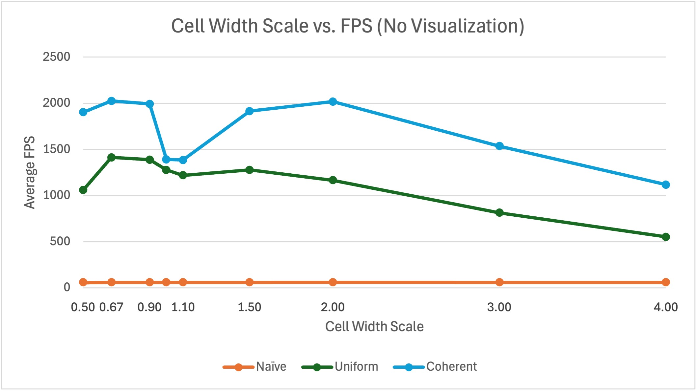
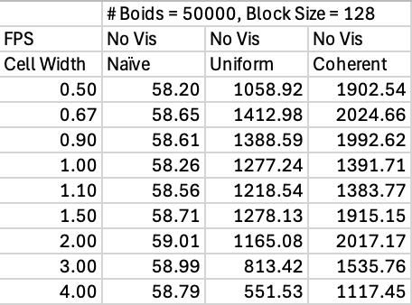

CUDA Flocking Simulation
========================

**University of Pennsylvania, CIS 5650: GPU Programming and Architecture, Project 1 - Flocking**

- Jordan Hochman
  - [LinkedIn](https://www.linkedin.com/in/jhochman24), [Personal Website](https://jordanh.xyz), [GitHub](https://github.com/JHawk0224)
- Tested on: Windows 11, Ryzen 7 5800 @ 3.4GHz 32GB, GeForce RTX 3060 Ti 8GB (Compute Capability: 8.6)

## Welcome to my Boid Flocking Simulation Project!

This project is an implementation based on the Reynolds Boids algorithm, along with a few optimizations: using a uniform grid, and a uniform grid with with semi-coherent memory access. If any of the gifs aren't moving, check out the source files for them in `/images/simulation`.

In this Boids flocking simulation, particles representing birds or fish (boids) move around the space according to three rules:

1. cohesion - boids move towards the perceived center of mass of their neighbors
2. separation - boids avoid getting to close to their neighbors
3. alignment - boids generally try to move with the same direction and speed as their neighbors

These three rules specify a boid's velocity change in a timestep, where each timestep, a boid thus has to look at each of its neighboring boids and compute the velocity change contribution from each of the three rules. Thus, a bare-bones boids implementation has each boid check every other boid in the simulation, which can be extremely inefficient.

This project implements the simulation on the GPU by running one thread for each boid that needs to be updated. However, there are still optimizations to be done.

## How the Simulation Works

This project implements the boid simulation in three different ways. First is the naive brute force approach, where at every time step, each boid checks all other boids to find neighbors and update its velocity accordingly. As you can imagine however, this is extremely slow and inefficient.

The second implementation uses a uniform grid to greatly minimize the search space required for each boid. It works by partitioning the entire simulation space into a grid, and then storing references for each grid cell pointing to which boids are in that cell. Then, when a boid is trying to update its velocity, instead of having to iterate over every boid, it only needs to check the grid cells which are nearby (within the neighborhood) and the boids in those cells. As you can imagine, this greatly speeds up the simulation as many fewer boids need to be checked. The detailed performance analysis is performed below.

Lastly, another optimization is performed on the uniform grid search, where it uses semi-coherent memory access instead. In the second implementation, the actual positions and velocities of the boids are stored in a buffer so that when we need to access them, we need to chase down a few pointers before we can actually get the data. Now normally this wouldn't be so bad, but this data is stored in global memory and global memory access on the GPU is extremely inefficient. Thus for this last optimization, we instead sort the position and velocity buffers ahead of time so they are already in the order we need, and we need to do less pointer chasing (which leads to fewer global memory reads). As a result, this again speeds up the simulation.

For more details about this exact process, as well as the specifics of the uniform grid, see `INSTRUCTIONS.md`.

## Running the Simulation

If you are interested in running this simulation, you may first want to ensure your computer is set up to do so. To do this, you can follow the instructions in [Project 0](https://github.com/JHawk0224/CIS5650-Project0-Getting-Started/blob/main/INSTRUCTION.md). After that, you may want to read through the [instructions](INSTRUCTION.md) for this project.

Additionally, you can tweak parameters found in `main.cpp` to change the program settings:

- `VISUALIZE` - turns the visualization on and off
- `UNIFORM_GRID` - turns on and off the optimization of using the uniform grid versus naive brute force
- `COHERENT_GRID` - turns on and off the optimization of the semi-coherent memory access
- `N_FOR_VIS` - controls the number of boids in the simulation
- `DT` - changes the simulation timestep

You may also be interested in changing the simulation parameters in `kernel.cu`:

- `rule1Distance`, `rule2Distance`, `rule3Distance` - the distance each boid simulation rule takes effect in
- `rule1Scale`, `rule2Scale`, `rule3Scale` - the magnitude of the effect of each rule
- `maxSpeed` - the max speed of each boid
- `scene_scale` - the size of the simulation
- `gridCellWidthScale` - **Important**: this controls how big the grid cells are in comparison to the rule distances. For example, if this value is 2, then the grid cells are twice the width of the maximum of the three rule distances above

All of the performance analysis below was performed with the visualization turned off.

### Naive Brute Force Approach

As explained above, in this approach, every boid checks every other boid to see if it is close enough and updates its velocity accordingly. Even when running this on the GPU with one thread per boid, it can be very inefficient. Here is a reference simulation with 5000 boids.

Note that all of the jitteriness/framiness of this gif is due to the limitations of the frame rate of the gif, not the simulation itself. Running the simulation itself looks just fine, and you can check this by looking at the fps counter in the top left corner.

Trying to push this simulation to higher boid counts does not go well. Actually, the intro gif of this project was the naive approach ran on 30000 boids, and you can already see a massive decrease in fps. Trying to run it with more boids will make it run even slower, so we need another approach.

### Scattered Uniform Grid Approach

As explained earlier, this approach uses a uniform grid to greatly minimize the search space required for each boid. See the explanation above for more details on how it works. Here is the simulation running with the same 5000 boids.

As you can see, it's already running much faster than the naive approach (over 1000 fps!). However, it also scales much, much better as we don't need to search every boid every time. Here is the simulation running with 100000 boids.

It barely slowed down compared to the 5000 boid simulation, and is handling it just fine. We're still hitting over 500 fps. However, how far can we push it?

### Coherent Memory Access Uniform Grid Approach

As explained earlier, there is still an issue with the global memory accesses during the simulation updates. We would like to minimize these for each boid, and this would push the performance even further. To do this, we rearrange the position and velocity buffers for the boids so they can be accessed contiguously, which requires one less pointer chase for each boid in each iteration (one less global memory access). Here is the simulation on 5000 boids.

Now we're getting over 1200 fps! How does it run on 100000 boids though?

It's still over 1000 fps, which is insane performance. A more detailed performance analysis will be performed below for better comparison.

### Other Optimizations

In addition to the optimizations mentioned above, there were two others that were done on both the uniform grid approaches. With the uniform grid, one might want to know how many neighbor cells do we need to check for boids? Well this depends on the neighborhood size defined by the three rules for velocity updates, but there are a few ways to implement this.

In the project code, we decided on a cell size which was twice the neighborhood size originally. This was done because then we only need to check the 8 neighboring cells (2x2x2) for boids. However, what if we want a more pragmatic approach? And do we actually need to check all 8 cells?

Of course, we don't. Thus both approaches also implemented the grid-looping optimization, where instead of hard-coding a designated search area (like 2x2x2 or 3x3x3), we limit the search based on any cells with any point _within the neighborhood distance_ (which as you can imagine, looks like a sphere). To do this, we first make the smallest cube possible based on going out the distance in any direction from the boid, but then we skip any cells that are too far away within this cube. With this optimization, we don't need to check as many cells for neighbors.

A breakdown of the performance vs. cell size tradeoff will be given below.

There is another optimization that can be done which should **greatly** increase performance, however I did not do it for this project. It involves using shared memory in the GPU to reduce global memory access even further, but implementing it would require a vastly different algorithm. This is because of the limited size of shared memory, we need to be very careful about which boids' information we store in there and when. Because the neighborhood around each boid might contain different cells per boid, to use the shared memory effectively across boids we would need a different method of partitioning the simulation space. A paper describing such an algorithm can be found [here](https://diglib.eg.org/server/api/core/bitstreams/79528ffd-9609-4232-bb81-57819e7ae747/content), and this is something that would be great to come back to and implement.

## Performance Analysis

First I will discuss the measurement of performance used for the analysis below. They are all comparing FPS (frames per second), where the time is measured by the GLFW timer. The numbers given below correspond to the average FPS over the first 10 seconds of running the program (averaged over 3 tries due to the random generation of boid positions). To find the average FPS over the first 10 seconds, first the number of frames is stored (which is how many iterations of the loop finished), divided by the total time it took to compute all those frames (so not quite 10 but very close, as this should be the total time for every frame to have been computed).

For the below comparisons, they were all done in Release mode, and with Vertical Sync (vsync) turned off. The specs of the computer they were run on is mentioned at the very top. All of the raw data for these runs can be found in the `simulation-data.xlsx` file [here](simulation-data.xlsx), although screenshots are provided throughout for convenience.

### Boid Count vs. Performance

The first performance analysis done was varying the number of boids. Of course, with more boids one would expect the performance to go down while in general, the optimized versions do better. These were run on 100, 500, 1000, 5000, 10000, 50000, 100000, and 500000 boids, each with a block size of 128 and cell width scale of 2 (explained later).

Here are the graphs of the performance tradeoff with and without the visualization respectively, for each of the three methods (which from here on out will be referred to as "Naive", "Uniform", and "Coherent"):

Note these are given in log scale, and if you are interested in seeing the version of this chart without the log-scaled axes, check out the appendix. Below is a summary of the data:

There are a few interesting things to note about these graphs. Starting with the Naive implementation, we see that as the boid count goes up, performance does indeed drop. However, we see that initially, for _very_ low boid counts (less than 1000), the performance for this is actually better than for Uniform or Coherent. The explanation for this is that the Naive method just iterates through every boid, so if there are few boids, this isn't really a big deal. It's not hard to iterate through only a few hundred boids, whereas the uniform grid adds more overhead and cells that have to be checked. Thus this result makes sense. But for large boid counts, iterating through them all would of course only get slower and slower due to its time complexity of O(n^2). The Uniform and Coherent approaches can handle many more boids due to their implementation.

Now comparing the Uniform approach and Coherent approach, we see that for low boid counts (up to about 10000), they perform relatively similar to themselves and to each other. This is because for Coherent, the optimization reduces the number of global memory accesses, but for low boid counts these accesses aren't the limiting factor for compute, but instead it's something else (e.g. the overhead for setting up the grid). As a result, limiting these accesses doesn't help all that much. However, as we get to large boid counts, then this does start making a difference. This is why they both don't see much of a performance drop when increasing boid counts below 10000. The bulk of the work doesn't come from the calculations of boid positions/velocities, but rather the overhead of managing the grid.

It's also interesting to compare the performance with and without visualization. It seems like adding the visualization just slightly decreases the total performance evenly for low boid counts, but this effect is less pronounced for high boid counts. This again makes sense because for low boid counts, drawing the visualization takes up much of the time and compute compared to the calculation of the boids' position and velocity. However, for higher boid counts, this position/velocity calculation is proportionally much larger than the time needed to draw the visualization, so adding it or removing it doesn't make as much of a difference.

There is another intriguing part of this data, and that's that the performance for Uniform and Coherent actually _increases_ slightly for around 500 to 1000 boids (see the bolded cells in the data). There is a possibility this is just due to a random variation in the workload of my computer, but it's also worth considering if there could be other causes. One potential explanation for this occurrence is that with fewer than 1000 boids, we are undersaturating the GPU, and it doesn't have enough work to do (so it's partially idle). As a result, it's wasting time and compute. However, when we have more boids, there are enough threads running so that the GPU is saturated and doing everything it can. This would cause the performance to go up, but then as the number of boids increases further, of course the performance would stop dropping again.

### Block Size vs. Performance

The effect of the block size/count versus performance was also measured. Here, the block size means the number of threads that were run in each block for all of the calls to the GPU. The reason one might want to investigate block size is that it can have some differences depending on the hardware the code is run on. Each GPU has a different number of SMs, and each SM can only handle a limited number of blocks and threads at a time. If a block size is too small, then the SM's resources might not be fully utilized, and there is GPU compute power that is being wasted. However, if the block size is too large, then the resources available to each SM might become exhausted (like shared memory or registers). This would cause fewer blocks to be scheduled, and thus reduce the parallelism.

This analysis was run with block sizes of 32, 64, 128, 256, 512, and 1024, the max allowable size. I decided on using 50000 boids for this analysis because it seemed like an amount where the benefits of each method were apparent, and there were noticeable performance differences. However one future avenue for performance analysis might be to look into the effect of block size at different boid counts. They were also run with a cell width scale of 2.

At a quick glance of these graphs, it really doesn't look like the block size has much of an effect on the performance. The reason this might be the case is that again, the performance in this project is mostly determined by the boid position/velocity calculation, so as long as enough work is being given to the GPU, there should not be much of a difference. The difference we see here is indeed very small when compared to all the performance differences we were seeing with the varying block size (no more than a 20% change here).

However, there are a few noticeable changes in this graph that are worth talking about. We can see in all three methods that the performance with small enough block sizes (32 threads) is slightly lower than the others. As alluded to in the previous paragraphs, this is likely because the GPU is not being given enough to do. With such a small block size, there might be resources in each SM that are going unused, causing a drop in performance, and the GPU is being underutilized. Likewise, there is also a performance drop at a block size of 1024 on the other end. This is again probably because the GPU is running out of resources on each SM, so it's can't process he threads as quickly as would be preferred.

This analysis demonstrates how important it is to find the sweet spot for the block size, and it can also be dependent on hardware. Additionally, for this entire performance analysis, the block count was set to be the value such that we had enough threads to cover all of the boids. It would be an interesting area for further investigation to see how the number of blocks, or the dimensionality of blocks affects performance.

### Cell Width vs. Performance

Now I will analyze the impact of the well width on the performance. Here, the cell width refers to the width of the cells in the uniform grid for both the Uniform and Coherent approaches. This width can make a very large difference in the performance because it completely changes how the algorithm behaves. From here on out, I will refer to the "neighborhood distance" as the maximum distance in which a boid checks for neighbors that might affect its position and velocity (the radius of the search).

Now with a very small cell width (much smaller than the neighborhood distance), we will have to check many, many cells in order to cover the entire neighborhood for each boid. As a result, there will be many more accesses to the cell data, but on the other hand each cell will probably contain few boids, if any. It might be a waste to have to check all of these cells, or maybe there's a perfect amount so that the amount of the grid we have to search is optimized.

On the flipside, with a very large cell width (larger than the neighborhood distance for example), we will only have to check the current cell, and possibly the direct neighboring cells in order to cover the current boid's neighborhood. This could be a benefit, but with this approach each cell might have lots of boids. You can imagine in the limit as the cell width increases, eventually it covers the entire grid and we're left with the naive brute force approach. Thus finding the sweet spot of the cell size also has a large impact on the performance.

Now since the actual width is a relative measurement, we need to define a baseline. From here on out, I will discuss the "cell width scale", which is the scale of the cell in proportion to the neighborhood distance. For example, if the cell width scale (sometimes referred to as just cell width) is 2.0, this means the width of the cell is twice the width of the neighborhood distance (the diameter of the neighborhood). If the cell width scale is 0.5, then the cell width is half the width of the neighborhood distance. If the cell width scale is 1.0, then the cell width equals the neighborhood distance.

Now what does this mean for checking neighbors? It means if the cell width scale is 2.0 (or larger), then only the 2x2x2 grid of neighboring cells need to be checked. This is because at this scale, the neighborhood diameter is at most the size of the cell, so it can entirely fit into a 2x2x2 area (the offset on which side is determined by how the boid is offset in its own cell). Thus we need to check at most 8 cells. If the cell width scale is between 1.0 and 2.0, then we will either need to check a 2x2x2 or 3x3x3 depending on where the boid is in its cell. If the cell width scale is 1.0, then we must check a 3x3x3 area around the boid, and if it's smaller than 1.0, then we will always need to check at least a 3x3x3 region.

I ran the analysis with cell width scales of 0.50, 0.67, 0.9, 1.0, 1.1, 1.5, 2.0, 3.0, and 4.0. For the same reason as with the block size analysis, I decided on using 50000 boids, and I used a block size of 128. Here is the data:

Now you might be wondering why I chose these cell width scales. Well at first, I actually only ran it with 0.5, 1.0, 2.0, 3.0, and 4.0. But that gave me a very interesting drop in performance only around 1.0. In order to investigate what was happening here in more depth, I ran a few more tests with cell width scales near this range. This let me get a better picture of what was going on.

First of all, there's no need to analyze the Naive approach here because the cell width doesn't affect how it runs at all (which is exactly what the data shows anyway). Now what exactly is going on with the other two approaches? For the high cell width values (at least 2.0), we see that the performance decreases. This makes sense because past this point, we always need to check a 2x2x2 grid at most, but the cells are getting larger and larger and contain more and more boids. As a result, even though we're still checking the same small number of cells, the number of boids we need to check is increasing. In the limit, this approaches the Naive method, so it makes sense that the performance drops off past 2.0.

Now why does the performance decrease suddenly at 1.0? Well this is exactly the cutoff when we start needing to search a 3x3x3 region. Since at this value we suddenly need to check more cells then we did before, we can expect the performance to drop compared to larger cell widths. But as the cell width slowly gets even lower, the performance gains we traded off start to come back because even though we need to search more cells, they have less and less boids in them.

Now as we go even lower, we see the performance starts dropping again. There are a couple possible causes of this. The first is that these are happening every time we need to start searching for a wider radius. For example, at 1/2.25=0.44, we start needing to search a 4x4x4 grid every time. Thus for the same reason as at 1.0, we would expect a performance drop here (and every other place where we need a wider radius of cells). However, another possible explanation is that as we start needing to search more and more cells, the amount of time it takes to fetch the cell data (the overhead of managing the uniform grid) starts to become prevalent. With more and more cells to search, the performance will decrease due to so many cell accesses. It is likely a combination of these two effects that is causing the drop in performance for very low cell widths.

Therefore, when changing the cell width to switch from checking 27 (width of 1.0) to 8 (width of 2.0) neighboring cells, we saw a performance increase. As explained previously, this is not necessarily because we have more cells to check with 27, but rather because the benefits of having that many cells haven't quite made up for the tradeoff yet. Slightly below a width of 1.0, we still get performance comparable to a width of 2.0 even though we are checking at least 27 cells. Thus it's not necessarily just due to the count of cells.

### Uniform vs. Coherent Grid Discussion

When we switched from the Uniform approach to also add the coherent memory access, we did see a major performance improvement (for large boid counts). This is exactly the outcome I expected because for large boid counts, the GPU would waste a lot of time to chase down the pointers in global memory. Thus minimizing these would always help performance. However, for low boid counts, the grid did not make that much of a difference. Again, this is because most of the compute time here is dedicated to other things, and not necessarily the global memory accesses. That is not the bottleneck when there are few boids, so the grid doesn't matter much.

### Appendix

Here is the graphs of the boid count versus FPS without the log scale:

## Extra Bloopers :D

Here are some fun things I came across doing this project!

I was trying to push how far the simulation could go, so here it is running on 1 million boids! This is the coherent memory uniform grid approach, and it's still running at over 100 fps!

