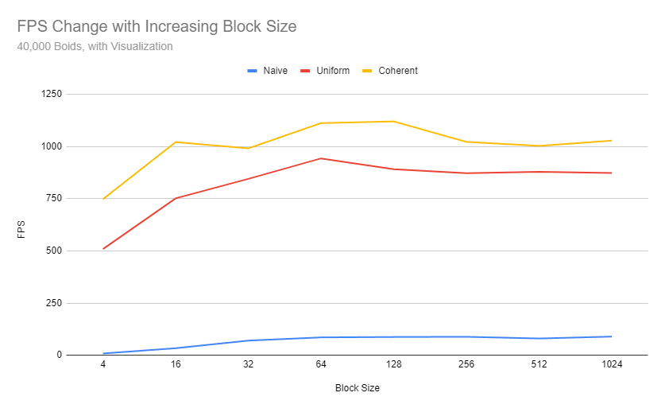

**University of Pennsylvania, CIS 5650: GPU Programming and Architecture,
Project 1 - Flocking**

* Christine Kneer
  * https://www.linkedin.com/in/christine-kneer/
  * https://www.christinekneer.com/
* Tested on: Windows 11, i7-13700HX @ 2.1GHz 32GB, RTX 4060 8GB (Personal Laptop)

## Part 1: Introduction

In the Boids flocking simulation, particles representing birds or fish
(boids) move around the simulation space according to three rules:

1. **cohesion** - boids move towards the perceived center of mass of their neighbors
2. **separation** - boids avoid getting to close to their neighbors
3. **alignment** - boids generally try to move with the same direction and speed as
their neighbors

These three rules specify a boid's velocity change in a timestep.

### 1.1 Naive Boids Simulation

In the naive simulation, a boid simply looks every other boid and compute the velocity
change contribution from each of the three rules (if within distance).

Example simulation:

||
|:--:|
|*5,000 boids, scene scale = 100*|

### 1.2 Uniform Grid Boids Simulation

Instead of examining every other boid, we use **uniform spatial grid** to cull each boid's neighbors.
If the cell width is double the neighborhood distance, each boid only has to be
checked against other boids in 8 cells.

Example simulation:

||
|:--:|
|*10,000 boids, scene scale = 100*|

### 1.3 Uniform Grid Boids Simulation (with coherent boid data)

Rearranging the boid data itself so that all the velocities and positions of boids in one cell are also
contiguous in memory.

Example simulation:

||
|:--:|
|*500,000 boids, scene scale = 200*|

## Part 2: Performance Analysis

In this section, we compare the performance of the Naive method, the Uniform Gird method, and the Coherent Unifrom Grid method based on framerate.

### 2.0 General Comparative Analysis

1. **Naive**: Significant parallelization compared to CPU implementation. However, for each boid, we must check all other boids to determine if they are within range (O(n2)).
2. **Uniform Grid**: Significantly reduce number of checks by culling neighbors (~O(n)).
3. **Coherent Uniform Grid**: Further improves upon the uniform grid method by ensuring that all boids within the same grid cell are stored contiguously in memory.

### 2.1 Boid Count vs FPS

||
|:--:|
|*with visualization, scene scale = 100*|

||
|:--:|
|*without visualization, scene scale = 100*|

* For each implementation, how does changing the number of boids affect
performance? Why do you think this is?

In general, increasing the number of boids causes the frame rate to drop. This is expected
since each additional boid increases the computational load, particulary when it comes to
calculating the interactions between boids. However, the degree of performance degration
differs significantly between the three methdos.

The **Naive** method suffers the most from performance degration, getting closer and
closer to an exponential decrease due to its O(n2) complexity.

The **Uniform Grid** and **Coherent Uniform Grid** method reduces the computational complexity
to O(n) by dividing the space into a grid of cells. Although both methods scale much better than
the naive method, overcrowded cells still causes increasing comupational load, lowering the frame
rate as cells become denser.

One interesting thing to note about the **Coherent Uniform Grid** method is that the frame rate 
actually increases drastically from 50k to 100k boids. It's possible that the distribution of boids
across grid cells is somewhat sparse or uneven at 50k, leading to inefficient memory access patterns
or GPU warp utilization.

### 2.2 Block Count & Size vs FPS

||
|:--:|
|*without visualization, boid count = 20, 000, scene scale = 100*|

* For each implementation, how does changing the block count and block size
affect performance? Why do you think this is?

The frame rate improves dramatically from block size 4 to block size 32, but
stablizes after block size 64. This is because GPUs execute threads in groups
of 32 called warps, and smaller block sizes means that the GPU would not be
fully utilized. However, beyond a certain point (block size 32/64), increasing
block size does not significantly improve performance anymore (even diminishing
returns) because GPU reaches its occupancy limit.

It is also interesting to note that the Naive method seems to benifit the most 
from block size increase, likely due to it being the most computationally expensive.

### 2.3 (Coherent) Uniform Grid vs FPS

* For the coherent uniform grid: did you experience any performance improvements
with the more coherent uniform grid? Was this the outcome you expected?
Why or why not?

As shown in the charts in Part 2.1, it can be seen that the Coherent Uniform Grid
method consistently outperforms the Uniform Grid method. It is expected since it
further optimizes the uniform grid method by improving memory access patterns. By
storing boid data contiguosly, cache efficiency and memory access latency are
further improved, especially as the number of boids increases.

### 2.4 Number of Neighboring Cells Check vs FPS

||
|:--:|
|*without visualization, scene scale = 100*|

||
|:--:|
|*without visualization, scene scale = 100*|

* Did changing cell width and checking 27 vs 8 neighboring cells affect performance?
Why or why not? Be careful: it is insufficient (and possibly incorrect) to say
that 27-cell is slower simply because there are more cells to check!

At low boid counts (1k - 5k), the performace difference between the 8-cell and 27-cell
checks is minimal. It seems that with fewer boids, both approaches handle neighbor searches
efficiently because the cells are simply not very dense. The overhead of checking either 8 or 27
cells does not have a major impact on performance, since the overall computational workload remains low.

At moderate boid counts (20k - 50k), the 8-cell check begins to outperforms the 27-cell check. 
The 8-cell approach might benifit from searching fewer cells, and perhaps
more efficient memory access patterns as fewer memory transactions are required. 
On the other hand, the 27-cell check might suffer from the overhead of searching more cells 
(and likely more boid-to-boid interactions) at this boid count.

At high boid counts (100k - 500k), the 27-cell check actually outperforms the 8-cell check.
The coarser partitioning in the 8-cell check results in too many boids per cell, which negates
the benifit of checking fewer neighboring cells. On the other hand, the finer grid and smaller cells
in the 27-cell check might help distribute the boids more evenly across each grid, resulting in fewer
boids per cell, and likely less total number of boid-to-boid interactions.

It is definitely incorrect to conclude that 27-cell is always slower simply because there are more cells to check,
becuase finer partitioning results in less boids to check per cell. The key trade-off is betweern the number of cells
being checked and the number of boids per cell.