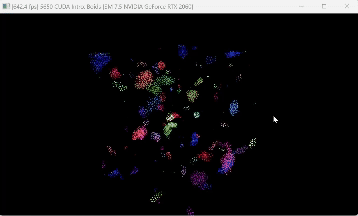
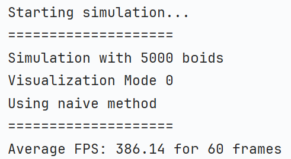

**University of Pennsylvania, CIS 5650: GPU Programming and Architecture,
Project 1 - Flocking**

* Kevin Dong
  * [LinkedIn](www.linkedin.com/in/xingyu-dong)
* Tested on: Windows 11, Intel(R) Core(TM) i7-10750H CPU @ 2.60GHz 2.59 GHz, GTX 2060

## Demo Gif

## Features

### Naive Boids Simulation
The naive simulation checks all other boids for a single point. This gives it very poor performance for a time 
complexity up to $O(n^2)$ (where $n$ is the number of boids).

### Uniform Grid Boids Simulation
The uniform grid simulation uses a uniform grid to limit the number of boids that need to be checked. This gives it a 
better performance up to $O(n)$, since only constant number of boids need to be checked for each boid.

### Coherent Uniform Grid Boids Simulation
The coherent uniform grid further improves the performance by reducing the memory access time. This is done by 
rearranging the boids array to be coherent with the grid. Though the time complexity does not change when compared to 
the uniform grid, the coherent uniform grid is faster as when can see in the performance section. The performance is 
expected to be better, since we no longer need to access the `particleArrayIndices` to access the position and velocity.

### Performance Analysis

#### Comparison among the three implementations
Using 5000 boids and 128 blockSize, Here are the results:

|                                              |                                                  |                                                    |
|:--------------------------------------------:|:------------------------------------------------:|:--------------------------------------------------:|
|  |  |  |

As we can see, the naive implementation is the slowest, the uniform grid is faster, and the coherent uniform grid is the 
fastest among the three. There is a big performance increase between the naive and uniform grid implementations, which 
matches our expectation since the theoretical time complexity is greatly reduced. The increase in performance between 
the uniform grid and coherent uniform grid is not as significant, but it is still noticeable.

#### Increasing the number of boids
For this test, we will keep the blockSize at 128 and increase the number of boids to be 5000, 10000, 20000, 25000, 
and 50000.

Increasing the number of boids greatly decreases the performance of the naive implementation, but the performance of 
the uniform grid and coherent uniform grid implementations are not affected as much. However, we can still see a trend 
of decreasing performance as the number of boids increases. This is expected since increasing the total number of boids 
increases the number of data points, which requires more computation. The naive method is affected the most because it 
has a time complexity of $O(n^2)$, so the increasing in $n$ will greatly affect its performance.

#### Increasing the number of threads per block (blockSize)
For this test, we will keep the number of boids at 5000 and increase the blockSize to be 32, 64, 128, 256, and 512.

