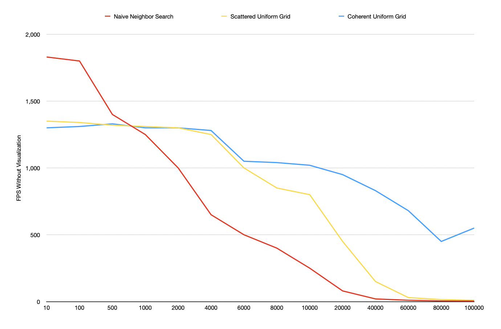

**University of Pennsylvania, CIS 5650: GPU Programming and Architecture,
Project 1 - Flocking**

* Deze Lyu
* Tested on: Windows 11, AMD Ryzen 5 5600U @ 2.30GHz 16GB, NVIDIA GeForce MX450 9142MB

### Deze Lyu

#### Animation

#### Answers

##### **Q1:** For each implementation, how does changing the number of boids affect performance? Why do you think this is?

**A:** In the Naive Neighbor Search method, the FPS decreases as the total count N increases because the algorithm has a time complexity of O(N) per thread. In contrast, the Scattered Uniform Grid and Coherent Uniform Grid methods offer better performance since both use grids to limit the number of neighbors that need to be searched and computed. The Coherent Uniform Grid method outperforms the Scattered Uniform Grid method because its most compute-intensive kernel has one fewer buffer to bind and read, and its memory access pattern is coherent rather than scattered, making it more efficient.

##### **Q2:** For each implementation, how does changing the block count and block size affect performance? Why do you think this is?

**A:** On my machine, the impact on performance after changing the block count and block size is not very noticeable, but I can still observe a slight performance improvement when the block size is moderately large. This is likely because a larger block size allows more threads to run in parallel, providing more processing power. However, if the block size becomes too large, the device needs to allocate more resources to keep the kernel running, which can negate the performance gains.

##### **Q3:** For the coherent uniform grid: did you experience any performance improvements with the more coherent uniform grid? Was this the outcome you expected? Why or why not?

**A:** As I mentioned earlier, the Coherent Uniform Grid method offers better performance because the kernel requires one fewer buffer to bind to and read from. Although this approach involves executing an additional kernel, the new kernel is less computationally intensive, and the optimization of the primary kernel results in a greater performance boost. Furthermore, since the neighboring cells are stored adjacent to each other, reading from them becomes faster due to a more efficient memory access pattern.

##### **Q4:** Did changing cell width and checking 27 vs 8 neighboring cells affect performance? Why or why not? Be careful: it is insufficient (and possibly incorrect) to say that 27-cell is slower simply because there are more cells to check!

**A:** When considering the nearest 8 cells, each cell must be large enough to cover the entire search radius. Otherwise, when the search circle is positioned at the center of a cell, it becomes impossible to cover all potential neighboring areas with just 8 cells. Therefore, the side length of each cell should be 2R. In contrast, when considering the nearest 27 cells, the side length can be exactly R, ensuring that the search area is fully contained within these 27 cells. As a result, the minimum side length required for the 8-cell case is 4R, while for the 27-cell case, it is 3R, which is smaller. This reduction in cell size means fewer elements need to be examined, reducing the workload and potentially improving performance. However, when the density of boids is low, the 8-cell case can be more efficient than the 27-cell case, as expected.

#### Graphs

##### FPS / N With Visualization

##### FPS / N Without Visualization

##### FPS / Block Size With Visualization

