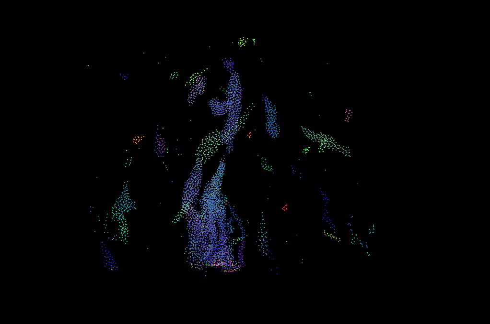

**University of Pennsylvania, CIS 5650: GPU Programming and Architecture,
Project 1 - Flocking**

* Elena Xinyue Peng
  * https://www.linkedin.com/in/elena-xinyue-peng-8b7a0a173/
* Tested on: Windows 10, Intel(R) Core(TM) i5-9400F CPU @ 2.90GH 48GB, NVIDIA GeForce GTX 1660 6144MB (Personal Desktop)

  
  
  
  

**Performance Analysis**

