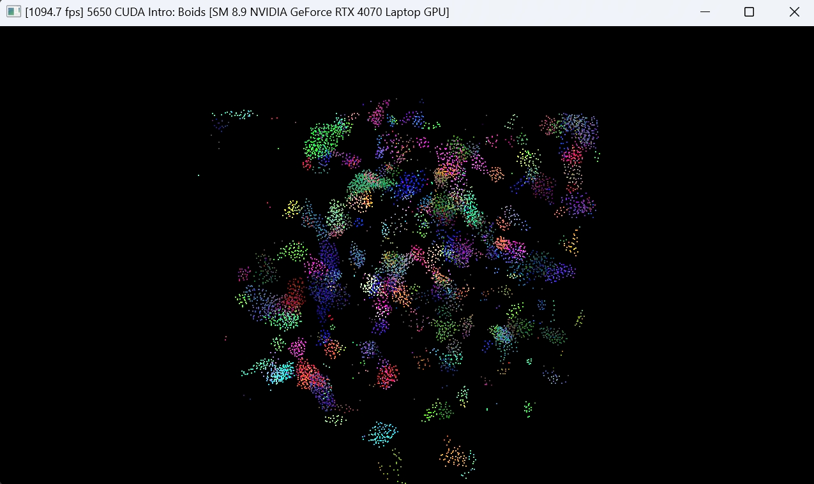
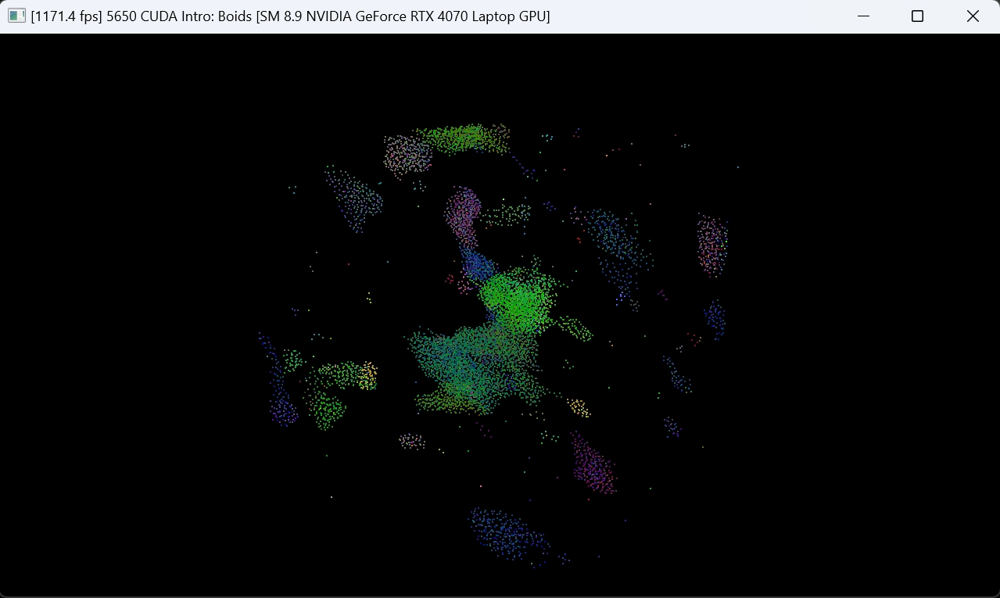

**University of Pennsylvania, CIS 565: GPU Programming and Architecture,
Project 1 - Flocking**
  
* XiaoyuDu  
* Tested on: Personal desktop, NVIDIA GeForce RTX 3080  
  
### Report  
  
* I changed the number of boids and compared their FPS as follows. This make sense since adding more boids requires GPU to do more calculations and slows down the FPS.  
  
* I also tested the change in FPS with respect to blockSize. I set the number of boids to 100000 and get the result as shown below. I didn't find a clear relationship between block size and FPS, but generally speaking FPS reach a peak when block size is 128 and gradually goes down. I think the reason behind is that when blockSize is too large, there will be more idle threads(such as those thread that exceed the number of boids).  
  
* As for the coherent uniform grid, I also test it with 100000 boids. Without coherent grid, the FPS is around 339.08. With coherent grid, the FPS increase to 1376.48. This makes sense to me since with coherent grid, the time takes to access the memory is sufficently lower.  